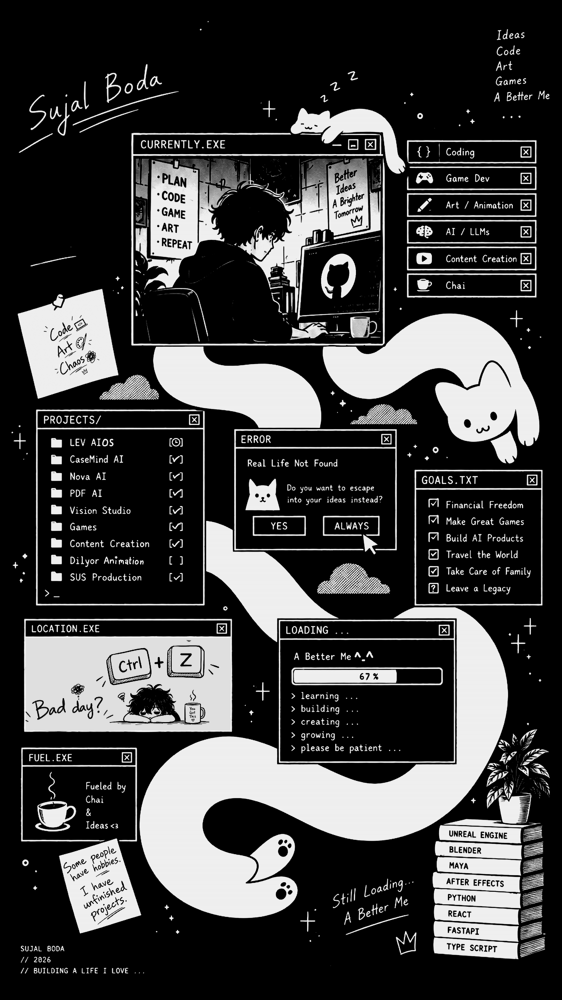

# Hi, I'm Sujal Boda 👋

### Full-Stack AI Engineer • Computer Vision • AI Products • Unreal Engine Developer

I build production-grade AI applications from idea to deployment.

My focus is building AI systems that solve real-world problems using FastAPI, React, Gemini, Computer Vision, Retrieval-Augmented Generation, and modern software architecture.

## 🚀 About Me

• 🤖 Building production-grade AI applications

• 🧠 Interested in AI Agents, Computer Vision and Multimodal AI

• 💻 Full-stack developer using React + FastAPI

• 🎮 Unreal Engine game developer

• 📍 Mumbai, India

## 🌟 Flagship Projects

### 🧠 Nova AI Platform

Enterprise AI Workspace

• Multi-provider AI
• Gemini
• JWT Authentication
• SSE Streaming
• Modern React UI

---

### 📄 PDF AI Workspace

Explainable AI + RAG

• ChromaDB
• Custom RAG
• PDF Intelligence
• Streaming
• Flashcards
• Quizzes

---

### 👁 Vision Studio AI

Enterprise Computer Vision Platform

• Gemini Vision
• YOLO
• OCR
• Segmentation
• Visual Analytics

---

### 🕵️ CaseMind AI

AI Investigation Workspace

• Digital Forensics
• Evidence Intelligence
• Knowledge Graphs
• Timelines
• AI Detective

## 🛠 Tech Stack

### Languages

Python
TypeScript
JavaScript
C#
SQL

### Backend

FastAPI
SQLAlchemy
Pydantic
SQLite
PostgreSQL

### Frontend

React
TypeScript
TailwindCSS
Vite

### AI

Google Gemini
Computer Vision
RAG
OCR
YOLO
OpenCV

### Game Dev

Unreal Engine 5
Unity 6
Blender
Maya

## 🎯 Currently Building

🕵️ CaseMind AI

Enterprise AI Investigation Platform

Coming Soon

• AI Agents
• Autonomous Workflows
• LEV AI

## 🗺 AI Engineering Roadmap

✅ Nova AI Platform

✅ PDF AI Workspace

✅ Vision Studio AI

✅ CaseMind AI

🔄 AI Agent Platform

🔄 MeetingMind

🔄 LEV AI

## 📫 Connect

📧 Email

sujalboda26@gmail.com

🌍 GitHub

https://github.com/suzi26-wtf

